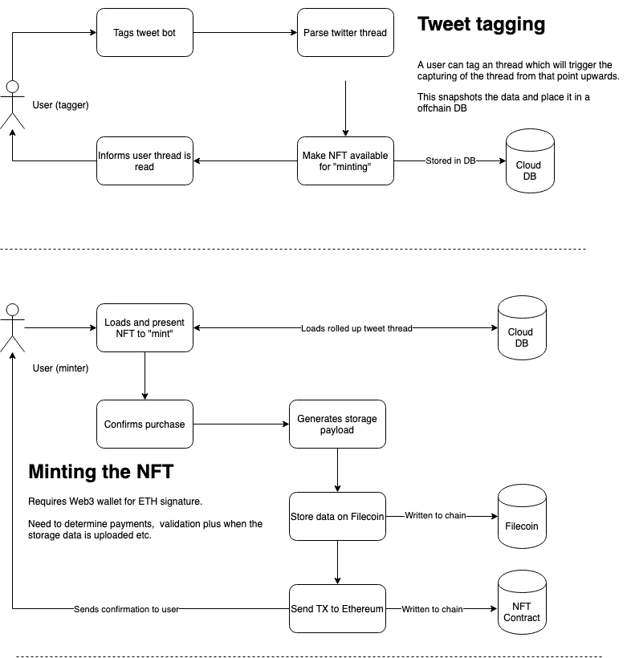
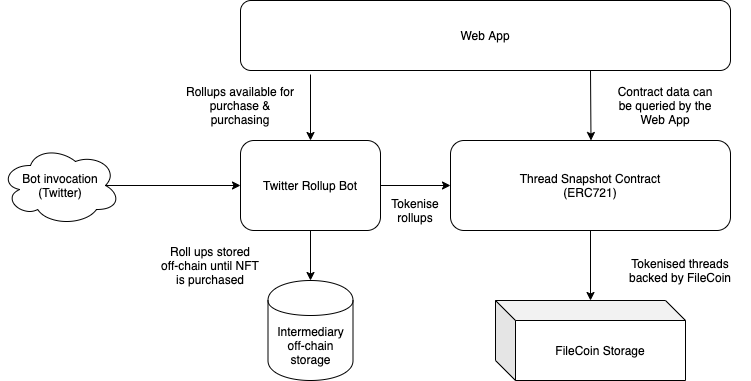

# NFTSnapshot-Bot
Filecoin-based NFTSnapshot Bot

## Project breakdown

* See `README` for each project for basic setup instructions 
*  [documentation](./documentation) - Some high level docs on how it works
*  [bot](./bot) - A twitter bot which response and rolls up thread ready for tokenising
*  [smart-contracts](./smart-contracts) - The ETh smart contracts which are responsible for issuing the NFTs
*  [webapp](./webapp) - A webapp where a user can claim ownership of a captured NFT

A demo fo the working application can be seen [here](https://drive.google.com/file/d/1oqAP_7B9iGms1IZ-nz-2wYP_yofVFjGu/view?usp=sharing)

### User Journey
 
 

### General architecture

 

## License

This work is dual-licensed under Apache 2.0 and MIT.

`SPDX-License-Identifier: Apache-2.0 OR MIT`
